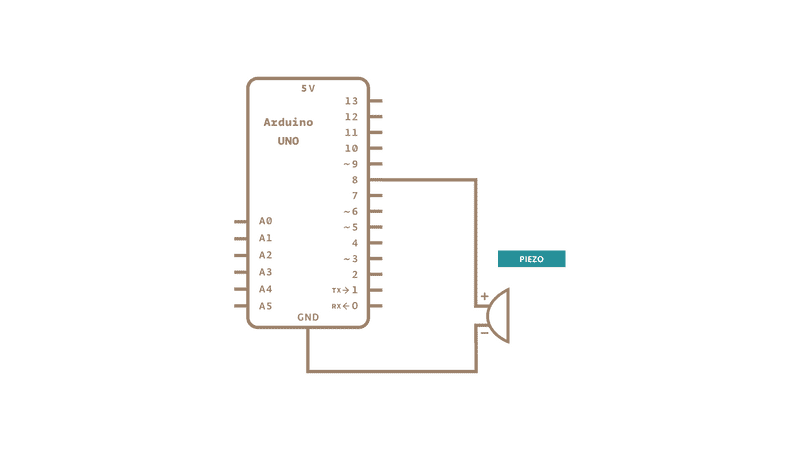

### Arduino fun

### Initial setup, to get started
Speaker: Adafruit thin plastic speaker 8 ohm (P1891B)

https://www.arduino.cc/en/Tutorial/BuiltInExamples/toneMelody

### Arduino and C++
Sources: 
- https://forum.arduino.cc/t/how-do-i-use-c-to-code-the-arduino-boards/493409/8
- https://andybrown.me.uk/2011/01/15/the-standard-template-library-stl-for-avr-with-c-streams/
- https://github.com/arduino-libraries/Arduino_AVRSTL

Arduino uses its own GCC compiler version called `avr-gcc`. Arduino has very limited RAM, so there is no STD in avr-gcc. There are however libraries which add their own implementation of the STD for `arv-gcc`, but these are not official and provide varying results.

### Essentials
Foundations: https://www.arduino.cc/en/Tutorial/Foundations

- `Serial.begin(rate)`
    initiating the serial output with a given rate, this rate should match in Arduino IDEs serial monitor
- `Serial.print()` and `Serial.println()`
    printing messages, `Serial.begin()` has to be invoked first

### Audio
- using buildin `tone` methods
- bad performance: using a software timer library
- high performance: using interupts and a hardware timer
- using audiofile player libraries

### PortManipulation 
Sources:
- https://electronoobs.com/eng_arduino_tut130.php
- https://www.arduino.cc/en/Reference/PortManipulation

There are multiple types of ports on an Arduino, to write to a port, you should use `digitalWrite` and `pinMode`. digitalWrite however has lots of overhead, so to optimize high frequency code, we can instead use port manipulation to directly access the registry where the data for the pins is stored. This process is called PortManipulation and is very powerfull and easy to do wrong. Doing something wrong here could destroy your board.
